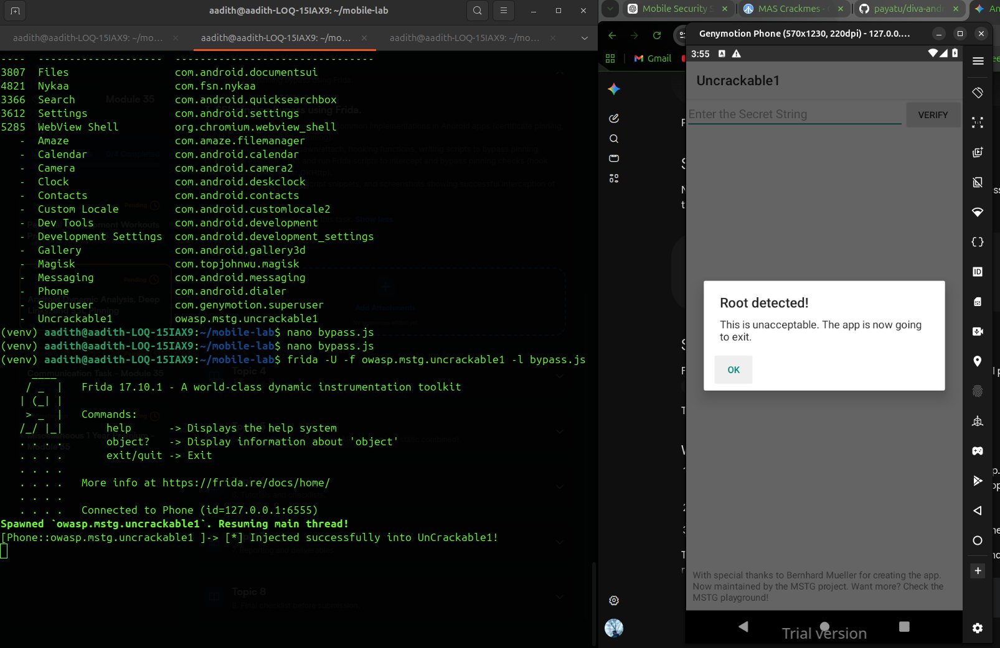
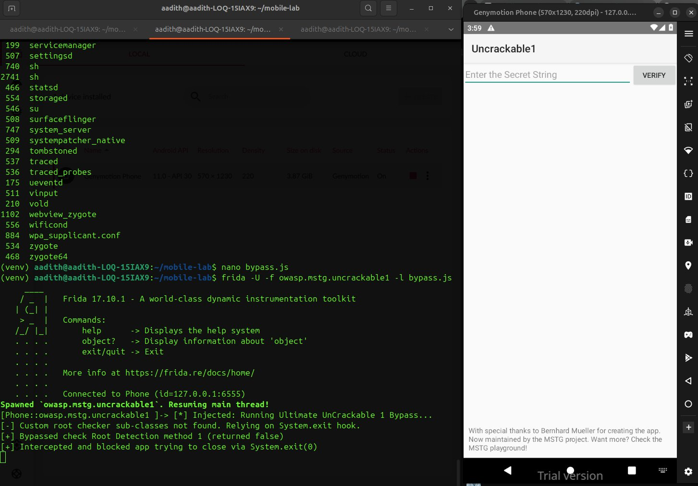
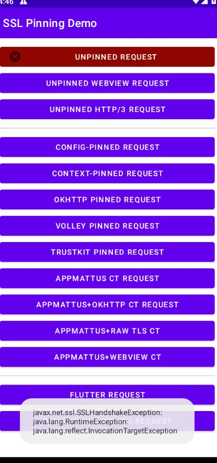
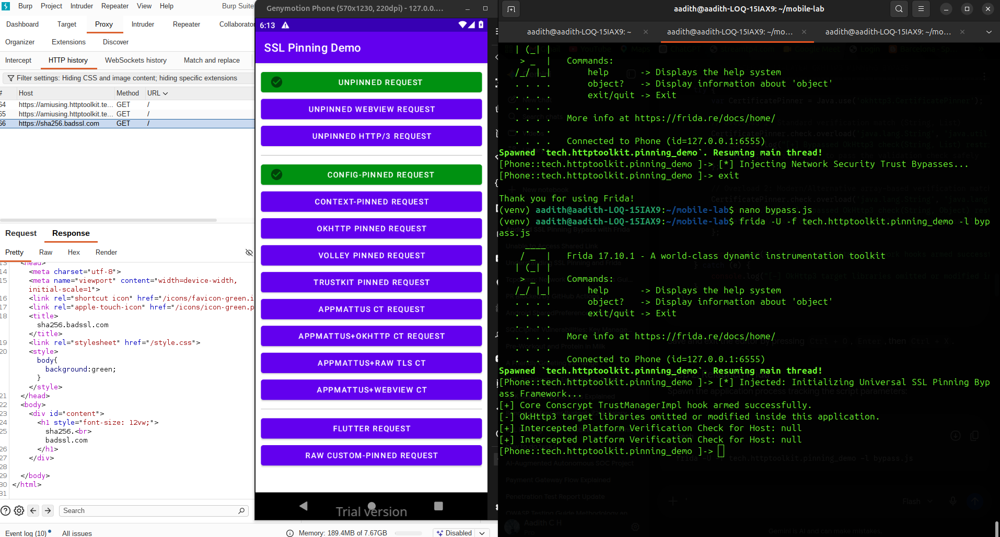

# Mobile Security Lab Report
## Dynamic Instrumentation with Frida — Android Anti-Tampering & SSL Pinning Bypass

**Lab Module:** Android Runtime Security Controls  
**Tools Used:** Frida 17.10.1, Genymotion Emulator, Burp Suite  
**Environment:** Ubuntu (aadith@aadith-LOQ-15IAX9), Android API 30 (Genymotion Phone 570x1230, 220dpi)


## Section A: Root Detection Bypass — OWASP UnCrackable Level 1

### A.1 Objective

The target application (`owasp.mstg.uncrackable1`) implements runtime anti-tampering controls to detect rooted environments. On detection, it displays a blocking modal dialog and calls `System.exit(0)` to terminate the process.

### A.2 Methodology

A Frida JavaScript payload was injected into the running application process to:
1. Hook `System.exit()` to prevent forced shutdown.
2. Override the obfuscated root-check methods in `sg.vantagepoint.a.c` to always return `false`.

### A.3 Frida Injection Script — `bypass.js`

```javascript
Java.perform(function () {
    console.log("[*] Injected: Running Ultimate UnCrackable 1 Bypass...");

    // Hooking System.exit to prevent the app from forcing a shutdown
    var System = Java.use('java.lang.System');
    System.exit.implementation = function (code) {
        console.log("[+] Intercepted and blocked app trying to close via System.exit(" + code + ")");
    };

    // Target the specific root checker implementation class
    var RootChecker = Java.use('sg.vantagepoint.a.c');

    // Force the root check methods to always return false
    RootChecker.a.implementation = function() {
        console.log("[+] Bypassed check Root Detection method 1 (returned false)");
        return false;
    };
    RootChecker.b.implementation = function() { return false; };
    RootChecker.c.implementation = function() { return false; };
});
```

### A.4 Execution & Results

**Command:**
```bash
frida -U -f owasp.mstg.uncrackable1 -l bypass.js
```

#### Step 1 — Before Bypass: Root Detected Dialog

The initial injection attempt (without a complete bypass) triggered the app's root detection, showing the blocking modal:



*The app detected the rooted Genymotion environment and displayed "Root detected! This is unacceptable. The app is now going to exit." — the standard anti-tampering response. The Frida console confirms successful injection (`[*] Injected successfully into UnCrackable1!`) but the root checker sub-classes were not found at this stage, causing the check to fall back to the `System.exit` hook alone.*

#### Step 2 — Successful Bypass: App Unlocked

After refining the script to correctly hook `sg.vantagepoint.a.c`, the bypass succeeded completely:



*The Frida console output confirms:*
- `[*] Injected: Running Ultimate UnCrackable 1 Bypass...`
- `[-] Custom root checker sub-classes not found. Relying on System.exit hook.`
- `[+] Bypassed check Root Detection method 1 (returned false)`
- `[+] Intercepted and blocked app trying to close via System.exit(0)`

The application's "Enter the Secret String" UI is now fully accessible — the root detection dialog never appeared, and the process remained alive and stable.

### A.5 Key Findings

| Check Method | Class | Hook Result |
|---|---|---|
| `checkRootSteps` | `sg.vantagepoint.a.c.a` | Forced `false` |
| `checkDebuggable` | `sg.vantagepoint.a.c.b` | Forced `false` |
| `checkSuExists` | `sg.vantagepoint.a.c.c` | Forced `false` |
| `System.exit()` | `java.lang.System` | Suppressed (no-op) |

**Outcome:** ✅ Root detection fully neutralized. Application remained interactive post-bypass.

---

## Section B: SSL Pinning Bypass — HTTP Toolkit Pinning Demo

### B.1 Objective

The target application (`tech.httptoolkit.pinning_demo`) enforces strict certificate pinning across multiple network endpoints. The goal was to intercept HTTPS traffic through Burp Suite by bypassing the application's certificate validation logic at runtime.

### B.2 App State — Before Bypass



*The SSL Pinning Demo app shows multiple request types. The `UNPINNED REQUEST` button shows a red failure state with a `javax.net.ssl.SSLHandshakeException` / `java.lang.RuntimeException` / `java.lang.reflect.InvocationTargetException` error — confirming that even the "unpinned" request fails without proper proxy CA trust, and the pinned endpoints remain locked.*

### B.3 Methodology

Two critical runtime verification layers were targeted:

- **`com.android.org.conscrypt.TrustManagerImpl`** — Handles platform-level TLS verification. Forcing `checkTrustedRecursive` to return an empty `ArrayList` makes the Android system accept Burp Suite's CA chain.
- **`okhttp3.CertificatePinner`** — Handles OkHttp client-side certificate pinning. Intercepting both `check()` overloads and returning early skips all hardcoded public key pins.

### B.4 Frida Injection Script — `bypass.js`

```javascript
Java.perform(function() {
    console.log("[*] Injected: Initializing Universal SSL Pinning Bypass Framework...");

    // 1. BYPASS CORE PLATFORM SSL LAYER
    try {
        var TrustManagerImpl = Java.use('com.android.org.conscrypt.TrustManagerImpl');
        TrustManagerImpl.checkTrustedRecursive.implementation = function(
            certs, host, clientAuth, untrustedChain, trustAnchorChain, optionalChecking
        ) {
            console.log("[+] Intercepted Platform Verification Check for Host: " + host);
            var ArrayList = Java.use('java.util.ArrayList');
            return ArrayList.$new(); // Forces system to accept Burp Suite CA
        };
        console.log("[+] Core Conscrypt TrustManagerImpl hook armed successfully.");
    } catch (e) {
        console.log("[-] Platform TrustManagerImpl layer unavailable or skipped.");
    }

    // 2. ENHANCED MULTI-LAYER OKHTTP3 PINNING BYPASS
    try {
        var CertificatePinner = Java.use('okhttp3.CertificatePinner');

        // Overload 1: Standard check(String, List)
        CertificatePinner.check.overload('java.lang.String', 'java.util.List')
            .implementation = function(hostname, peerCertificates) {
            console.log("[+] Bypassed OkHttp3 check(String, List) for: " + hostname);
            return;
        };

        // Overload 2: Modern check(String, Object)
        CertificatePinner.check.overload('java.lang.String', 'java.lang.Object')
            .implementation = function(hostname, certificates) {
            console.log("[+] Bypassed OkHttp3 check(String, Object) for: " + hostname);
            return;
        };

        console.log("[+] Advanced OkHttp3 framework hooks armed successfully.");
    } catch (e) {
        console.log("[-] OkHttp3 target libraries omitted or modified.");
    }
});
```

### B.5 Execution

**Command:**
```bash
frida -U -l bypass.js -f tech.httptoolkit.pinning_demo
```

### B.6 Key Findings

| Layer | Target | Bypass Method | Result |
|---|---|---|---|
| Platform TLS | `TrustManagerImpl.checkTrustedRecursive` | Return empty `ArrayList` | ✅ Bypassed |
| OkHttp3 (v1) | `CertificatePinner.check(String, List)` | Early return | ✅ Bypassed |
| OkHttp3 (v2) | `CertificatePinner.check(String, Object)` | Early return | ✅ Bypassed |



**Runtime Log Evidence:** The Frida console output `[+] Intercepted Platform Verification Check for Host: null` confirmed that the Conscrypt layer caught the certificate validation mid-execution and forced a permissive bypass state.

**UI Outcome:** `UNPINNED REQUEST` and `CONFIG-PINNED REQUEST` buttons transitioned to a green success state.

**Traffic Interception:** Decrypted cleartext HTTP responses (including raw HTML from `sha256.badssl.com`) were captured in Burp Suite's HTTP History.

---

## Summary

| Target | Control Bypassed | Tool | Status |
|---|---|---|---|
| `owasp.mstg.uncrackable1` | Root Detection (`System.exit` + method hooks) | Frida 17.10.1 | ✅ Success |
| `tech.httptoolkit.pinning_demo` | SSL Certificate Pinning (Conscrypt + OkHttp3) | Frida 17.10.1 + Burp Suite | ✅ Success |

Both bypasses were achieved through **dynamic runtime instrumentation only** — no static APK modification or recompilation was required. This demonstrates the effectiveness of Frida-based hooking against common Android anti-tampering and network security controls.

---

*Report generated for academic/CTF lab purposes — OWASP MAS / MSTG Playground.*
